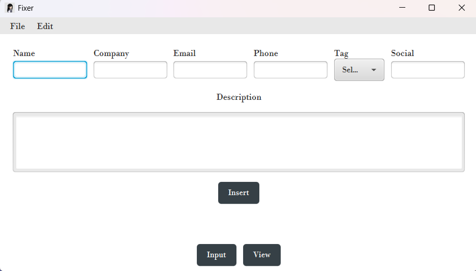
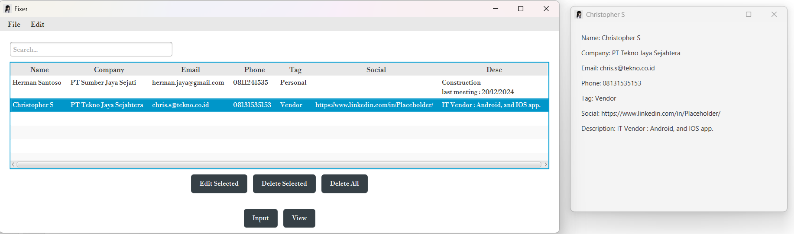

# Fixer

> *"You need a fixer, you know how to reach me."* — every fixer in Night City, probably

A desktop CRM for tracking the people behind a job search — recruiters, talent scouts, hiring managers, vendors — and when you last talked to them. Built with JavaFX and SQLite.




## Why this exists

Job hunting eventually means fielding messages from a rotating cast of recruiters, talent searchers, companies, and vendors — and losing track of who's who. Who reached out last month? Which recruiter already has your CV? When did you last actually talk to them?

Fixer exists to answer that: a lightweight, always-local record of every "important person" in your job search — who they are, what they're tagged as, and notes on where things stand — instead of scattered emails, LinkedIn DMs, and memory.

The name is a nod to *Cyberpunk 2077*: in Night City, a Fixer is the middleman who lines up your next job. Felt fitting for an app whose entire job is tracking the people lining up yours.

## Features

- **Contact management** — add, edit, and delete contacts with Name, Company, Email, Phone, Tag, Social, and Description fields
- **Live search** — filter records instantly across all fields as you type
- **Custom tags** — create, rename, and remove your own categories (e.g. Recruiter, Vendor, Hiring Manager) via Edit → Edit Tags
- **Record details** — double-click any row in the table for a full detail view
- **Local storage** — data is stored in a local SQLite database, no server or internet connection required
- **Update notifications** — checks for new releases on startup and shows a banner if one is available

## Tech Stack

- **Java 21** (JavaFX)
- **SQLite** (via `sqlite-jdbc`)
- **Maven** for build and dependency management
- **jpackage** for building a native Windows installer

## Getting Started

### Prerequisites

- JDK 21 or later
- Maven (bundled with NetBeans, or install separately)

### Running from source

```bash
git clone https://github.com/fariz-armesta/fixer.git
cd fixer
mvn clean javafx:run
```

### Building a Windows installer

Requires [WiX Toolset v3.14](https://github.com/wixtoolset/wix3/releases) installed and on your system PATH.

```bash
mvn clean package jpackage:jpackage
```

The installer `.exe` will be generated in `target/dist`.

## Project Structure

```
fixer/
├── src/main/java/com/mycompany/fixer/
│   ├── Fixer.java              # Main application entry point and UI
│   ├── Launcher.java           # Non-JavaFX entry point (required for jpackage)
│   ├── DatabaseManager.java    # SQLite database access layer
│   ├── Contact.java            # Contact data model
│   ├── RecordsWindow.java      # Table view, search, and record actions
│   ├── TagManagerWindow.java   # Tag add/rename/remove UI
│   └── UpdateChecker.java      # Checks GitHub for newer versions
├── src/main/resources/
│   ├── icon.png / icon.ico     # App icons
│   ├── fonts/                  # Bundled custom font
│   └── style.css               # Application styling
└── pom.xml
```

## Data Storage

Contact data is stored locally at:
```
%USERPROFILE%\.fixer\fixer.db
```
This keeps your data intact even when the app is reinstalled or updated.

## License

This project is licensed under the [MIT License](LICENSE).
